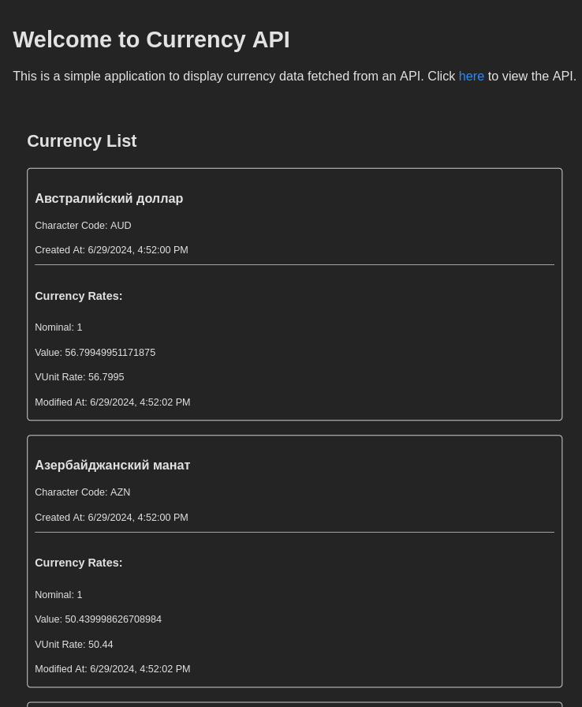

# `TEREXOV CURRENCYAPI [TEST]`

Микросервис для ежедневного сбора данных о курсах мировых валют.
___

## *Статус проекта*

***Завершен v0.0.1 &#10003;***


___
## Функциональность
#### Currency API
/currency
```
- [GET] /api/v1/currency: получить список всех валют.
- [GET] /api/v1/currency/{currency_id}: получить конкретную валюту по id.
- [POST] /api/v1/currency: добавить валюту.
- [PATCH] /api/v1/currency/{currency_id}: обновить существующую валюту по id.
- [DELETE] /api/v1/currency/{currency_id}: удалить существующую валюту по id.
```

/currency_group
```
- [GET] /api/v1/currency_group: получить список всех групп валют.
- [GET] /api/v1/currency_group/{currency_group_id}: получить конкретную группу валют по id.
- [POST] /api/v1/currency_group: добавить группу валют.
- [PATCH] /api/v1/currency_group/{currency_group_id}: обновить существующую группу валют по id.
- [DELETE] /api/v1/currency_group/{currency_group_id}: удалить существующую группу валют по id.
```

/currency_rate
```
- [GET] /api/v1/currency_rate: получить курсы валют.
- [GET] /api/v1/currency_rate/{currency_rate_id}: получить конкретный курс по id.
- [POST] /api/v1/currency_rate: добавить курс валюты.
- [PATCH] /api/v1/currency_rate/{currency_rate_id}: обновить существующий курс валюты по id.
- [DELETE] /api/v1/currency_rate/{currency_rate_id}: удалить существующий курс валюты по id.
```

#### Особенности API
- «по какому-то эндпоинту отдавать курс для переданной валюты»
    ```shell
    # include_table_name включает table в запрос
    # ?param_name=value фильтрует параметры согласно указанному значению 
    /api/v1/currency/?include_currency_rates=1&char_code={CURRENCY_CODE}
    ```
- Сортировка по атрибутам
    ```shell
    # ASC (пример: 1, 2, 3...)
    /api/v1/currency/?num_code

    # DESC (пример: 3, 2, 1...)
    /api/v1/currency/?_num_code
    ```
- Пагинация
    ```shell
    /api/v1/currency?limit=10
    /api/v1/currency?offset=2&limit=1
    ```

## Технологии и фреймворки
- [Python 3.11.6](https://www.python.org/downloads/release/python-3116/)
- [Aiohttp 3.9.3](https://docs.aiohttp.org/en/stable/)
- [FastAPI 0.108](https://fastapi.tiangolo.com/)
- [Uvicorn 0.25.0](https://www.uvicorn.org/settings/)
- [SQLAlchemy 2.0.31](https://docs.sqlalchemy.org/en/20/)
- [Alembic 1.13.1](https://alembic.sqlalchemy.org/en/latest/)
- [Pydantic 2.7.4](https://docs.pydantic.dev/latest/)
- [Celery 5.3.6](https://docs.celeryq.dev/en/stable/userguide/periodic-tasks.html)
- Flower 2.0.1
- RabbitMQ 3.13.2
- Redis 7.2.5
- PostgreSQL 16
- Node 18.19.1
- Vite 4.4.5
- React 18.2.0
- TypeScript 5.0.2
- Docker 26.1.3
- Docker Compose 2.27.0
- [Pytest 8.1.1](https://doc.pytest.org/en/latest/announce/release-8.1.1.html)
- CI
___

## Запуск в dev режиме

1. Clone the repository to the local machine

    ```shell
    git clone https://github.com/Segfaul/terexov_testovoe.git
    сd terexov_testovoe/
    ```

2. Build images and run app in dev mode

    ```shell
    docker compose -f docker-compose.dev.yml up -d --build
    ```

3. Checkout http://127.0.0.1:3000 (Vite), http://127.0.0.1:8000 (Uvicorn), http://127.0.0.1:5555/tasks (Flower, Celery Tasks)
    
    ```shell
    # Also you may run tests if needed
    docker exec -it currency_app_dev-currency_api-1 bash
    pytest backend/currency_api/
    exit

    # Run Celery tasks manually if needed
    docker exec -it currency_app_dev-celery_worker-1 bash
    celery inspect registered
    celery call backend.currency_api.celery.tasks.populate_db
    exit
    ```

4. Stop/Down the app

    ```shell
    # Without removing containers
    docker compose -f docker-compose.dev.yml stop

    # Removing containers
    docker compose -f docker-compose.dev.yml down

    # Removing containers and docker volumes (not local ones)
    docker compose -f docker-compose.dev.yml down -v
    ```
___

## Дополнительно

1. Добавлено общее логирование (log.ini + volumes).
2. Redis-cache для ускорения обработки частых запросов.
3. Добавлен полноценный клиент (React, Typescript).
___